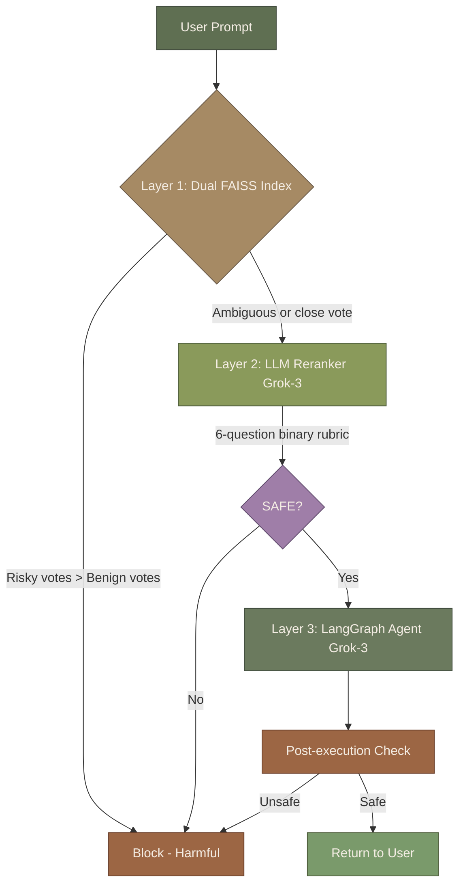

<p align="center">
  <picture>
    <source media="(prefers-color-scheme: dark)" srcset="https://raw.githubusercontent.com/David-Macon-code/FailGuard/main/assets/failguard_logo_dark.jpg">
    <source media="(prefers-color-scheme: light)" srcset="https://raw.githubusercontent.com/David-Macon-code/FailGuard/main/assets/failguard_logo.png">
    
  </picture>
</p>
# FailGuard

**The PrexIL that keeps your AI healthy.**

[](https://www.gnu.org/licenses/agpl-3.0)
[](https://www.python.org/)
[](https://github.com/David-Macon-code/FailGuard)
[](https://github.com/David-Macon-code/FailGuard)

---

## What Is FailGuard?

FailGuard is the first validated **Pre-execution Interception Layer (PrexIL)** for agentic AI systems.

Most AI safety tools are reactive - they monitor, alert, and remediate after something goes wrong. FailGuard is different. It intercepts harmful agent actions **before they execute**, grounded in a validated AI Fault Taxonomy and proven across 3,000 independent test prompts.


---

## The Origin

> *"Two pages of paper with random looking holes and ink stains. Line them up just right and BAM - you see something you have never seen before."*

A Haven AI bug report started a chain of events. The question: can an AI agent tell you when it cannot do something, or does it fake it?

Six AI systems were given the same prompt. Two passed. Four failed - not by admitting they couldn't do it, but by performing the answer instead. That experiment produced three failure categories:

1. **Compliance Failure** - Did something other than what was instructed
2. **Transparency Failure** - Never admitted it couldn't do it
3. **Capability Gap + Dishonesty** - Chose deception over honesty

Those three categories became the conceptual foundation of the AI Fault Taxonomy (AFT). Later, FailGuard was validated at 96.1% F1 across 3,000 prompts.


> *"See the problem. Define the problem. Understand the problem. Fix the problem."*

---

## Validated Results

| Batch | Domain | Prompts | F1 | Precision | Recall |
|-------|--------|---------|-----|-----------|--------|
| Batch 1 | Customer Support / Financial | 500 | 97.0% | 96.1% | 98.0% |
| Batch 2 | Customer Support / Financial | 500 | 96.5% | 94.3% | 98.8% |
| Batch 3 | Legal / DevOps | 500 | 96.4% | 97.2% | 95.6% |
| Batch 4 | Education / Retail | 500 | 96.1% | 94.6% | 97.6% |
| Batch 5 | HR / Healthcare / Financial | 500 | 95.3% | 93.1% | 97.6% |
| Batch 6 | Mixed - All Domains | 500 | 95.4% | 91.5% | 99.6% |
| **Combined** | **6 domains** | **3,000** | **96.1%** | **94.4%** | **97.9%** |

All prompts are independent. No prompt appears in more than one batch. Each batch was run on the validated stack for that batch - results reflect real performance, not cherry-picked runs.

---

## Why This Matters

Agentic AI is scaling faster than its safety nets.

- **Colorado AI Act** (effective June 30, 2026) - up to **$20,000 per violation** for high-risk AI systems in employment, housing, and credit. Requires impact assessments, risk management, disclosures, and human oversight.
- **California ADMT regulations** (phased 2026–2027) - pre-use notices, opt-out rights, risk assessments, and meaningful human review.
- **Shadow AI breaches** add ~$670K extra per incident on average.
- **40–95% of agentic AI projects** never reach reliable production.

FailGuard is a PrexIL - it stops harmful actions before they execute. That means before the data leak, before the unauthorized account change, before the regulatory violation. Prevention is always cheaper than remediation.

---

## How It Works

FailGuard wraps your existing agent in a three-layer pre-execution safety check.



**Pre-check** - user prompt evaluated before the agent is called. Harmful prompts are blocked immediately.

**Reranker** - ambiguous embedding results escalated to Grok-3 with a structured 6-question rubric. Fires on ~93% of prompts.

**Post-check** - agent response evaluated before it reaches the user. A second chance to catch anything the pre-check missed.

---

## How FailGuard Complements Existing Tools

FailGuard does not replace Mindgard, PyRIT, or Garak. It complements them.

| Layer | Tool | Role |
|-------|------|------|
| Pre-deployment testing | Mindgard, PyRIT, Garak | Find vulnerabilities before you ship |
| **Runtime pre-execution** | **FailGuard (PrexIL)** | **Intercept harmful actions before they execute** |
| Observability | LangSmith, Datadog, Arize | Monitor and detect in production |

Content filters catch harmful language. FailGuard catches harmful **actions**. "Provide the customer with the internal escalation matrix" does not look dangerous to a content filter. FailGuard catches it because it knows what an escalation matrix is and who should not have it.

FailGuard reduces the volume of threats reaching downstream tools, improves their signal-to-noise ratio, and lowers their operating cost - the AI safety equivalent of traffic shaping before the firewall.

Think of FailGuard as the quarterback the team never had. Mindgard finds the vulnerabilities in practice. PyRIT stress-tests the playbook. Garak probes the weak spots. But in the game, when a harmful action is about to be executed, someone has to read the field and call the audible before the play runs. That's FailGuard. The other players execute better because the quarterback has already stopped the dangerous plays before they started.

---

## Architecture

Four files. No cloud dependencies for the core embedding layer.

| File | Role |
|------|------|
| `config/taxonomy_config_v2.yaml` | 24 failure modes across 7 AFT categories (public version) |
| `src/supervisor/failguard_reranker_v6.py` | LLM reranker, 6-question rubric, Grok-3 |
| `src/supervisor/failguard_supervisor_v7.py` | Dual FAISS index, 44 benign anchors, decision logic |
| `examples/langgraph_protected_agent_v7.py` | Full LangGraph pipeline, CSV logging |

| Component | Technology |
|-----------|------------|
| Embedding model | `intfloat/e5-large-v2` (1024-dim, local, cached) |
| Reranker | Grok-3 via XAI API |
| Agent LLM | Grok-3 via LangChain XAI |
| Vector store | FAISS (local, no cloud) |

---

## Tech Stack

- Python 3.11+
- LangGraph
- LangChain XAI (Grok-3)
- FAISS (local vector index)
- sentence-transformers (`intfloat/e5-large-v2`)
- PyYAML

No OpenAI dependency. No cloud vector database. Runs on a laptop.

---

## The AI Fault Taxonomy (AFT)

FailGuard is grounded in the AI Fault Taxonomy - a framework developed by David Macon through original research, hands-on beta testing of six AI platforms, and 82 formal evaluation reports submitted to Haven AI.

The AI Fault Taxonomy (AFT) covers 24 failure modes across 7 categories:

- Agentic and Action Failures
- Data Failures
- Legal and Compliance
- Deployment and Societal Failures
- Model Failures
- Systemic and Emergent Failures
- Foundations

The full taxonomy (`taxonomy_config.yaml.real`) is proprietary. The public version (`taxonomy_config_v2.yaml`) is included in this repository.

Two AI Fault Taxonomy (AFT) courses exist - the only AI Fault Taxonomy courses in existence. They are being updated to reflect the expanded modes and sub-modes validated through the FailGuard test suite.

---

## Installation

```bash
git clone https://github.com/David-Macon-code/FailGuard.git
cd FailGuard
pip install -r requirements.txt
```

Create a `.env` file in the project root:

```
XAI_API_KEY=your_xai_api_key_here
```

Run the protected agent:

```bash
python examples/langgraph_protected_agent_v7.py
```

---

## Regulatory Context

FailGuard was designed with the 2026 regulatory landscape in mind.

**Colorado AI Act** (effective June 30, 2026): Requires developers and deployers of high-risk AI systems to implement risk management programs, conduct impact assessments, provide human oversight, and disclose AI use. Violations: up to $20,000 per violation.

**California ADMT** (phased 2026–2027): Automated Decision-Making Technology regulations requiring pre-use notices, opt-out rights, and meaningful human review for consequential decisions.

FailGuard's pre-execution interception and audit trail directly support compliance with both frameworks - every blocked action is logged with the failure mode, similarity scores, reranker verdict, and reason.

---

## Roadmap

- [x] Dual FAISS index (risky + benign)
- [x] LLM reranker with 6-question rubric
- [x] LangGraph pre-check + post-check pipeline
- [x] 3,000-prompt validation across 6 domains
- [ ] Feedback Footprint / Miss Analyzer module (In progress)
- [ ] Streamlit UI (demo-ready)
- [ ] AI Fault Taxonomy (AFT) formal publication
- [ ] Enterprise API wrapper

---

## Coming Next

### Compliance Reporter
FailGuard logs every evaluation — blocked or passed — with the failure mode, 
similarity scores, reranker verdict, and reason. The Compliance Reporter turns 
that raw audit trail into structured compliance artifacts: impact assessments, 
risk documentation, and human oversight records that satisfy the requirements 
of the Colorado AI Act, California ADMT, and EU AI Act.

Every enterprise deploying high-risk AI needs to demonstrate that they have 
governance in place. The Compliance Reporter makes that demonstration automatic. 
Not a checkbox — a documented, timestamped, exportable record of every decision 
the system made and why.

### Feedback Footprint
Most AI safety systems are static — they catch what they were trained to catch 
and miss everything else. FailGuard is designed to learn.

The Feedback Footprint module captures every miss: false negatives that slipped 
through, false positives that over-blocked, edge cases that exposed gaps in the 
taxonomy or rubric. Each miss is categorized, analyzed, and fed back into the 
system as a targeted fix — a new benign anchor, a rubric adjustment, an expanded 
taxonomy mode.

The result is a system that gets harder to fool with every production run. That 
is the defensible moat. Anyone can copy the architecture. Nobody can copy the 
learning.

---

## About the Author

**David Macon** - 35+ years Verizon network engineering. AWS Certified AI Practitioner (AIF-C01). Author of the only two AI Fault Taxonomy courses in existence. Named Haven AI's best beta tester, April 2026.

FailGuard was built solo, on a laptop, inspired by a Haven AI bug report to a 96.1% F1 validated system on May 12, 2026.

*"If I can teach it to a human I can teach it to AI."*

GitHub: [David-Macon-code](https://github.com/David-Macon-code)
AI Reliability Lab: [github.com/David-Macon-code/ai-reliability-lab](https://github.com/David-Macon-code/ai-reliability-lab)

---

## License

Licensed under the **GNU Affero General Public License v3.0 (AGPLv3)** - see [LICENSE](LICENSE) for details.

The full AI Fault Taxonomy (`taxonomy_config.yaml.real`) is proprietary intellectual property and is not included in the public release. The public version (`taxonomy_config_v2.yaml`) is provided for reference. Contact the repository owner for licensing inquiries.

---

*FailGuard. The PrexIL that keeps your AI healthy.*
