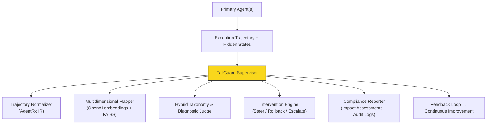

# FailGuard

**Proactive AI Agent Failure Prevention with Multidimensional Root-Cause Mapping**

## Business Problem

Agentic AI is scaling faster than its safety nets. By 2027, **74% of enterprises** expect to use AI agents at least moderately, yet **~80% lack mature governance** and guardrails.

The consequences are expensive:

- **High failure rates**: 40–95% of agentic AI projects never reach reliable production, with many abandoned after significant sunk costs (often $150K+ per project).
- **Real financial pain**: Shadow AI breaches add ~$670K extra per incident. LLM hallucinations alone have cost businesses tens of billions. Production agents can delete databases, leak data, or make costly decisions autonomously — sometimes in minutes.
- **Regulatory risk**: 
  - **Colorado AI Act** (effective June 30, 2026) imposes up to **$20,000 per violation** for high-risk AI systems (employment, housing, credit, etc.). Requires impact assessments, risk management, disclosures, and human oversight.
  - **California ADMT regulations** (phased 2026–2027) mandate pre-use notices, opt-out rights, risk assessments, and meaningful human review.
- **Opportunity cost**: Companies that get agents right see **$3.70–$10 ROI per $1 invested**, 10–25% EBITDA uplift, and major productivity gains. Those that don’t waste time and money on brittle pilots.

## The Gap

Most existing tools offer static taxonomies, post-mortem analysis, or simple content filters. They treat failures as surface symptoms ("pictures") rather than **multidimensional origins** in trajectories, latent spaces, and architecture — exactly what regulators and enterprises now demand evidence of managing.

## FailGuard’s Value Proposition

FailGuard is an open-source **supervisory meta-agent** that:

- Combines proven taxonomies (Microsoft Agentic Failure Modes, MAST 14 modes, 5 architectural fault dimensions + 12 root causes, AgentRx diagnostics, TRAIL, etc.).
- Maps agent trajectories **multidimensionally** (embeddings + clustering in high-dimensional space).
- Detects drift toward failure basins **in real time**.
- Intervenes proactively (steering, rollback, alerts) before critical failures occur.
- Provides built-in compliance artifacts for 2026 regulations.

## Business Outcomes It Enables

- Reduce failure rates and debugging time for agent deployments.
- Lower risk of costly incidents, compliance violations, and reputational damage.
- Accelerate safe movement from pilots to production → faster ROI.
- Deliver auditable diagnostics and observability that satisfy enterprise governance and regulatory needs.

## Key Features

- **Hybrid Taxonomy Engine** — Merges multiple research taxonomies into one queryable system.
- **Multidimensional Mapping** — Real-time embedding + FAISS clustering to spot geometric drift toward failure basins.
- **Real-Time Prevention** — Pre-execution checks, critical-step localization (AgentRx-style), and interventions.
- **Compliance Module** — Automated impact reports, bias auditing, human oversight hooks, immutable audit trails (Colorado AI Act / California ADMT ready).
- **Observability** — Logs, visualizations, and exportable diagnostics.

## Architecture Overview

## Tech Stack (Solo-Developer & Laptop Friendly)

- Python 3.11+
- LangGraph (recommended) or OpenAI Agents SDK
- OpenAI (text-embedding-3-large + GPT-4o-mini for cost control)
- FAISS / Chroma (local vector DB)
- LangSmith (free observability tier)
- Streamlit (optional UI)

## Target Users

- Solo developers and small teams building agents.
- HR tech, recruiting, and compliance-focused teams (high-risk domains).
- Mid-market companies deploying internal agents (support, ops, DevOps).
- Researchers and open-source contributors working on agent reliability.

## Market Context (2026)

- AI Agents market: ~$8–11B and growing at 47–50% CAGR.
- Guardrails / Observability / Governance layer: Multi-billion and expanding rapidly as a critical (and increasingly mandatory) enabler.

## Project Roadmap (Solo)

**Phase 1**: Repo setup, taxonomy loader, offline analyzer → **Completed**  
**Phase 2**: Multidimensional mapping + diagnostic judge → **Completed**  
**Phase 3**: Live supervisor + real Grok LLM integration + interventions → **Completed**  
**Phase 4**: Compliance reports + broader testing + domain examples → **In Progress**  
**Phase 5**: UI polish, documentation, and community examples → **In Progress**

## Installation

Detailed setup and examples coming soon.

## Contributing

This project started as a solo effort. Contributions are welcome!
See CONTRIBUTING.md for details.

## License
This project is licensed under the GNU Affero General Public License v3.0 (AGPLv3).
The core failure taxonomy is protected intellectual property and is not public.
